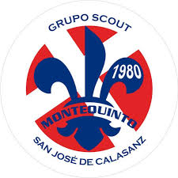

  

# ⚜️ Grupo IV Scout Montequinto

---

## ⌨️ Descripción del Proyecto

Este proyecto es la **página web oficial del Grupo IV Scout Montequinto**, diseñada para ofrecer información, recursos y servicios digitales a los miembros del grupo, sus familias y la comunidad.  

Además de ser un **portal informativo**, funciona como un **centro gestivo para la jefatura**, facilitando la organización de actividades, seguimiento de miembros y coordinación de tareas internas.

---

## 🛠️ Funcionalidades Principales

- 📰 **Portal Informativo:** Noticias, eventos y actividades.  
- 🗂 **Gestión Interna:** Herramientas administrativas para la jefatura.  
- 📱 **Interfaz Intuitiva:** Diseño moderno y responsivo.  
- 🔒 **Seguridad:** Autenticación de usuarios y protección de datos sensibles.  

---

## ⚙️ Tecnologías Utilizadas

- **Frontend:** React, TailwindCSS, React Router  
- **Backend:** Node.js, Express, Sequelize  
- **Autenticación y Seguridad:** JWT, bcrypt  
- **Control de Versiones:** Git  

---

## 📂 Estructura del Proyecto

/src

/components → Componentes reutilizables

/screens → Pantallas principales

/context → Estados globales (ej. AuthContext)

/assets → Imágenes y recursos estáticos

/routes → Definición de rutas

/controllers → Lógica de negocio

/models → Modelos de la base de datos

---

## 🤝 Contribuciones

Este proyecto está abierto a contribuciones de miembros y colaboradores. Se recomienda seguir la guía de buenas prácticas de Git y Pull Requests.

---

## 📬 Contacto

Para más información o consultas, contactar con la jefatura del Grupo IV Scout Montequinto a través del [Instagram](https://www.instagram.com/scoutsmonte5) del grupo.
